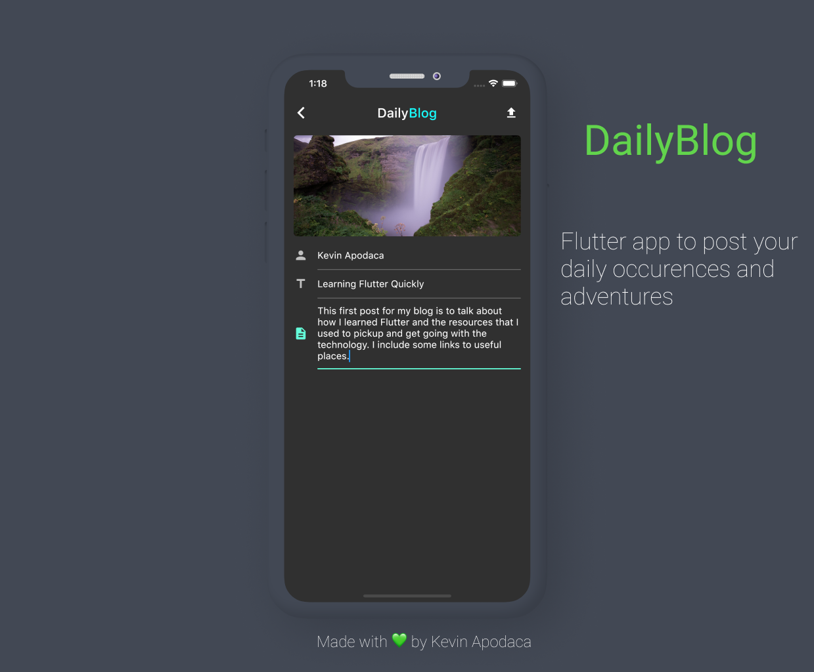

<h1 align="center"> DailyBlog </h1>  

  

  A flutter app to document your daily adventures and thoughts

## Introduction

This app lets you create new blogs with images, and pull your previous blogs for you to read. Using Firebase Storage

  

## Features

I implemented the following features to NowNews:

* Live updates / refresh
* Image Permissions
* Streams
* Tooltips
